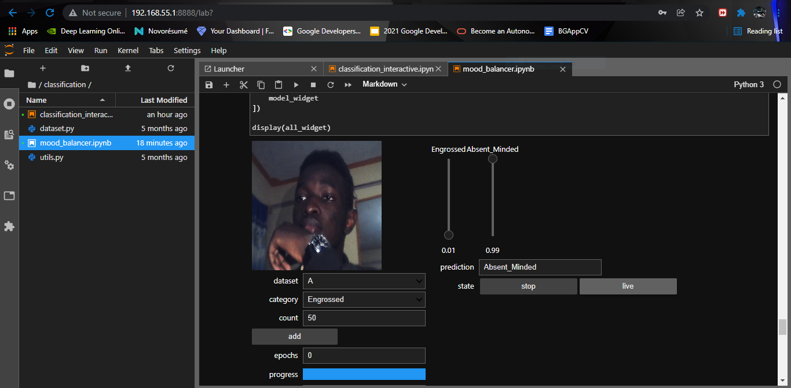

# Mood Balancer Project on Environment Container by [Billy Gareth](https://www.linkedin.com/in/billy-gareth-87b052173/)


This container is used in the NVIDIA Deep Learning Institute course Getting Started with AI on Jetson Nano and should be run on an NVIDIA Jetson Nano.  This project is an application of the Jetson AI Fundamentals and the Jetson AI Certification Program. I highly recommend you take the full free course, and check out other self-paced online courses and instructor-led workshops available from [the NVIDIA Deep Learning Institute List of Quality Programs](https://www.nvidia.com/en-us/deep-learning-ai/education/).

## Prerequisites/Requirements for this project:

The following are required to run this container and successfully complete the project

* [NVIDIA Jetson Nano Developer Kit](https://developer.nvidia.com/embedded/jetson-nano-developer-kit) or [NVIDIA Jetson Nano 2GB Developer Kit](https://developer.nvidia.com/embedded/jetson-nano-2gb-developer-kit)
* microSD memory card (64GB UHS-I minimum recommended) flashed with the [current Jetson Nano Developer Kit SD Card image](https://developer.nvidia.com/embedded/jetpack#install)
* USB Camera such as Logitech C270 Webcam (or a CSI camera)
* USB cable (Micro-B to Type-A)
* Internet connection for Jetson Nano do download this Docker image
* Compatible Power Supply (must be 5V 4A with 2.1mm DC barrel connector if using the original 4GB Jetson Nano Developer Kit)
* 2-pin jumper (original 4GB version only)
* Optional: monitor, keyboard, and mouse

## How to Use the Container
If you've never used Docker, we recommend their _[Orientation and Setup](https://docs.docker.com/get-started/)_.

## Remember
Classes here are two in this task: the Engrossed and the Absent minded


#### Model Specifications


##### Deep Learning Framework used:


## Putty and Windows PowerShell
#### Open Putty and specify the following:
* Port - 115200
* Connection Type - Serial
* Host Name for ip address - COM3 (depending on what's shown as configuration to the Jetson Nano Kit on your computer).
now click "Open".


#### Open Windows PowerShell:
start by ssh code: ssh username@192.168.55.1


### Set the Data Directory
The data collected during the course is stored in a mounted directory on the host device. This way, the data and trained models aren't lost when the container shuts down. The commands below assume the mounted directory is `~/nvdli-data`, so make sure you create it first:

```shell
mkdir ~/nvdli-data
```

### Run the Container
Run the container using the container tag that corresponds to the version of JetPack-L4T that you have installed on your Jetson. 

| JetPack Release &nbsp;&nbsp;&nbsp;&nbsp;&nbsp;&nbsp; | Container Tag &nbsp;&nbsp;&nbsp;&nbsp;&nbsp;&nbsp; | Language
|-|-| - 
| 4.4 | v2.0.0-r32.4.3 | en-US
| 4.4.1 | v2.0.1-r32.4.4 | en-US
| 4.4.1 | v2.0.1-r32.4.4zh | zh-CN
| 4.5 | v2.0.1-r32.5.0 | en-US
| 4.5 | v2.0.1-r32.5.0zh | zh-CN
| 4.6 | v2.0.1-r32.6.1 | en-US
| 4.6 | v2.0.1-r32.6.1zh | zh-CN
<br>

The `docker run`  command will automatically pull the container if it is not on your system already.

##### USB Camera option:

```
sudo docker run --runtime nvidia -it --rm --network host \
    --volume ~/nvdli-data:/nvdli-nano/data \
    --device /dev/video0 \ 
    nvcr.io/nvidia/dli/dli-nano-ai:v2.0.1-r32.6.1
```

##### CSI camera option:

```
sudo docker run --runtime nvidia -it --rm --network host \
    --volume ~/nvdli-data:/nvdli-nano/data \
    --volume /tmp/argus_socket:/tmp/argus_socket \
    --device /dev/video0 \ 
    nvcr.io/nvidia/dli/dli-nano-ai:v2.0.1-r32.6.1
```

note: if you have both CSI and USB cameras plugged in (or multiple USB cameras), also add `--device /dev/video1` above. Then in the DLI notebooks, you will need to set the `capture_device` number to 1 (the CSI camera will be `/dev/video0` and the USB camera will be `/dev/video1` - don't use the CSI camera through V4L2)

##### Options Explained:
* *--runtime nvidia* will use the NVIDIA container runtime while running the l4t-base container
* *-it* means run in interactive mode
* *--rm* will delete the container when finished
* *--network host* allows the container to use your Jetson host network and ports
* *--volume* defines a mounting directory, and is used to share the persistent data files and the CSI camera socket between the Jetson host and the container
* *--device* allows access to the video device


### Connect to JupyterLab
When the container is launched, the JupyterLab server will automatically start. Text similar to the following will be printed out to the user:

```
allow 10 sec for JupyterLab to start @ http://192.168.55.1:8888 (password dlinano)
JupterLab logging location:  /var/log/jupyter.log  (inside the container)
You can then navigate the browser on your PC to the URL shown above (http://192.168.55.1:8888) and login to JupyterLab with the password dlinano. Then proceed with the DLI course as normal.
```

## run the script
./docker_dli_run.sh and then open your Jupyter Lab and execute the notebook

## Note:
* Ensure you take your own pictures with variety of behaviours to distinguish the two categories. Feel free to take as many pictures as you want, one of the differences you'll notice will be; training will be slower since the time taken for a single epoch(pass through the dataset) will depend on the data itself, hence it'll be long!
* Also, try and balance the number of images taken for each category




## Technical Support

If you have any questions or need help, please visit the [Jetson Developer Forums](https://forums.developer.nvidia.com/c/agx-autonomous-machines/jetson-embedded-systems/70)

## License

Copyright 2020 NVIDIA

Licensed under the Apache License, Version 2.0 (the "License");
you may not use this file except in compliance with the License.
You may obtain a copy of the License at

[http://www.apache.org/licenses/LICENSE-2.0](http://www.apache.org/licenses/LICENSE-2.0)

Unless required by applicable law or agreed to in writing, software
distributed under the License is distributed on an "AS IS" BASIS,
WITHOUT WARRANTIES OR CONDITIONS OF ANY KIND, either express or implied.
See the License for the specific language governing permissions and
limitations under the License.

### Base Image Used for This Container

Also used in this container, and with its own licensing:

* [NVIDIA L4T PyTorch](https://ngc.nvidia.com/catalog/containers/nvidia:l4t-pytorch)

### Software Installed on Top of Base Image

Also used in this container, and with its own licensing:

* [Node.js](https://nodejs.org/en/)
* [libffi-dev](https://packages.debian.org/jessie/libffi-dev)
* [libssl1.0-dev](https://packages.debian.org/stretch/libssl1.0-dev)
* [JupyterLab](https://jupyterlab.readthedocs.io/en/stable/)
* [jetcam](https://github.com/NVIDIA-AI-IOT/jetcam)
